# File Backup & Sync - Flowchart

```mermaid
flowchart TD
    Start([Start: sync.sh]) --> SetEnv["Set bash options<br/>set -euo pipefail"]
    SetEnv --> ResolveDir["Resolve script directory<br/>SCRIPT_DIR = pwd"]
    ResolveDir --> SourceLibs["Source libraries<br/>- logger.sh<br/>- utils.sh"]
    
    SourceLibs --> ParseArgs["Parse command line arguments<br/>(-c, -s, -n, -v, -h)"]
    
    ParseArgs --> CheckUserInput{User Input<br/>Flag Set?}
    CheckUserInput -->|Yes| GetInput["Call get_user_input<br/>Ask for:<br/>- Source dirs<br/>- Dest dir<br/>- Dest type"]
    GetInput --> CreateTemp["Create temp_config.conf<br/>with user input"]
    CreateTemp --> LoadConfig["Load configuration<br/>from CONFIG_FILE"]
    
    CheckUserInput -->|No| LoadConfig
    
    LoadConfig --> ValidateFile{Config File<br/>Exists?}
    ValidateFile -->|No| ErrorConfig["Log error:<br/>Config not found"]
    ErrorConfig --> ExitError1["Exit code 1"]
    ValidateFile -->|Yes| LoadDefault["Source default config"]
    
    LoadDefault --> CheckLocal{Local Override<br/>exists?}
    CheckLocal -->|Yes| LoadLocal["Source local override<br/>.local.conf"]
    CheckLocal -->|No| SetupLog["Setup LOG_DIR and LOG_FILE<br/>Default: ./logs<br/>Format: sync_YYYYMM.log"]
    LoadLocal --> SetupLog
    
    SetupLog --> CreateLogDir["Create log directory<br/>if not exists"]
    CreateLogDir --> StartTime["Record start time"]
    StartTime --> SetupTrap["Setup EXIT trap<br/>for cleanup function"]
    
    SetupTrap --> LogStart["Log: === File Backup & Sync starting ===<br/>Log config and log file paths"]
    LogStart --> CheckDryRun{Dry-Run<br/>Mode?}
    CheckDryRun -->|Yes| LogDryRun["Log warning:<br/>DRY-RUN mode enabled"]
    CheckDryRun -->|No| CheckDeps
    LogDryRun --> CheckDeps
    
    CheckDeps["Check DEST_TYPE<br/>for rsync or rclone"] --> CheckType{DEST_TYPE<br/>Valid?}
    CheckType -->|rsync| CheckRsync["Check if rsync<br/>command exists"]
    CheckType -->|rclone| CheckRclone["Check if rclone<br/>command exists"]
    CheckType -->|Other| ErrorType["Log error:<br/>Unknown DEST_TYPE"]
    ErrorType --> ExitError2["Exit code 1"]
    
    CheckRsync --> DepsOk{Deps<br/>Available?}
    CheckRclone --> DepsOk
    DepsOk -->|No| ExitError3["Exit code 1"]
    DepsOk -->|Yes| ValidateSources
    
    ValidateSources["Parse SOURCE_DIRS<br/>into array"] --> CheckSources{All source<br/>dirs exist<br/>& readable?}
    CheckSources -->|No| ErrorSources["Log errors for<br/>invalid sources"]
    ErrorSources --> ExitError4["Exit code 1"]
    CheckSources -->|Yes| AcquireLock
    
    AcquireLock["Acquire lock<br/>/tmp/file_backup_sync.lock"] --> LockCheck{Lock<br/>Available?}
    LockCheck -->|Stale| RemoveStale["Remove stale lock"]
    RemoveStale --> CreateLock["Create new lock with PID $$"]
    LockCheck -->|Free| CreateLock
    LockCheck -->|Running| ErrorLock["Log error:<br/>Another sync running"]
    ErrorLock --> ExitError5["Exit code 1"]
    
    CreateLock --> MainLoop["FOR each directory in SOURCE_DIRS"]
    MainLoop --> LogDir["Log: Processing: {dir}"]
    LogDir --> CheckDestType{DEST_TYPE?}
    
    CheckDestType -->|rsync| SyncRsync["Call sync_rsync function"]
    CheckDestType -->|rclone| SyncRclone["Call sync_rclone function"]
    
    SyncRsync --> RsyncBuild["Build rsync options:<br/>- -a: archive mode<br/>- --delete: remove extra<br/>- --progress<br/>- --human-readable"]
    RsyncBuild --> RsyncDry{Dry-Run?}
    RsyncDry -->|Yes| RsyncOpt1["Add --dry-run"]
    RsyncDry -->|No| RsyncOpt2["No additional flag"]
    RsyncOpt1 --> RsyncExtra{RSYNC_EXTRA<br/>_OPTS set?}
    RsyncOpt2 --> RsyncExtra
    RsyncExtra -->|Yes| AddExtra1["Add extra options"]
    RsyncExtra -->|No| ExecuteRsync
    AddExtra1 --> ExecuteRsync["Execute rsync command<br/>{src}/ → {dest}/"]
    ExecuteRsync --> LogRsyncOutput["Log each rsync output line<br/>at DEBUG level"]
    LogRsyncOutput --> NextDir
    
    SyncRclone --> RcloneBuild["Build rclone options:<br/>sync --progress"]
    RcloneBuild --> RcloneDry{Dry-Run?}
    RcloneDry -->|Yes| RcloneOpt1["Add --dry-run"]
    RcloneDry -->|No| RcloneOpt2["No additional flag"]
    RcloneOpt1 --> RcloneExtra{RCLONE_EXTRA<br/>_OPTS set?}
    RcloneOpt2 --> RcloneExtra
    RcloneExtra -->|Yes| AddExtra2["Add extra options"]
    RcloneExtra -->|No| ExecuteRclone
    AddExtra2 --> ExecuteRclone["Execute rclone command<br/>{src} → {dest}"]
    ExecuteRclone --> LogRcloneOutput["Log each rclone output line<br/>at DEBUG level"]
    LogRcloneOutput --> NextDir
    
    NextDir{More<br/>directories?}
    NextDir -->|Yes| MainLoop
    NextDir -->|No| RotateLogs["Rotate old log files<br/>Keep LOG_RETENTION<br/>most recent"]
    
    RotateLogs --> CleanupStart["Cleanup trap triggered:<br/>Calculate elapsed time"]
    CleanupStart --> CheckExit{Exit<br/>Code 0?}
    
    CheckExit -->|Success| LogSuccess["Log: Sync completed successfully<br/>Log elapsed time"]
    CheckExit -->|Failure| LogFailure["Log: Sync failed<br/>Log exit code and time"]
    
    LogSuccess --> SendNotif1["Send desktop notification<br/>SUCCESS: Sync completed in Xs"]
    LogFailure --> SendNotif2["Send desktop notification<br/>FAILURE: Sync failed"]
    
    SendNotif1 --> ReleaseLock["Release lock file<br/>rm /tmp/file_backup_sync.lock"]
    SendNotif2 --> ReleaseLock
    
    ReleaseLock --> End([End])
    ExitError1 --> End
    ExitError2 --> End
    ExitError3 --> End
    ExitError4 --> End
    ExitError5 --> End
    
    style Start fill:#90EE90
    style End fill:#FFB6C6
    style ErrorConfig fill:#FFE4E1
    style ErrorType fill:#FFE4E1
    style ErrorSources fill:#FFE4E1
    style ErrorLock fill:#FFE4E1
    style MainLoop fill:#ADD8E6
    style CheckDestType fill:#FFE4B5
    style CheckExit fill:#FFE4B5
```

## Legende

| Symbol | Bedeutung |
|--------|-----------|
| Ellipse | Start/End |
| Rechteck | Prozess/Aktion |
| Raute | Entscheidung (if/else) |
| Blau | Hauptschleife |
| Orange | Wichtige Entscheidungen |
| Hellrot | Fehlerbehandlung |

## Ablauf - Zusammenfassung

### Phase 1: Initialisierung
1. **Bash-Optionen setzen** (strict mode: `set -euo pipefail`)
2. **Script-Verzeichnis auflösen** für relative Pfade
3. **Libraries laden** (logger.sh, utils.sh)

### Phase 2: Argument-Parsing
- Kommandozeilen-Argumente verarbeiten (`-c`, `-s`, `-n`, `-v`, `-h`)
- Bei `-s`: Benutzer-Input abfragen und temp. Config erstellen

### Phase 3: Konfiguration laden
- Haupt-Config-Datei laden
- Optional: Lokale Override-Config laden
- Log-Verzeichnis und Log-Datei vorbereiten
- EXIT-Trap für Cleanup registrieren

### Phase 4: Pre-Flight-Checks
1. **Abhängigkeiten prüfen** (rsync oder rclone vorhanden?)
2. **DEST_TYPE validieren** (rsync oder rclone?)
3. **SOURCE_DIRS validieren** (existieren und lesbar?)
4. **Lock erwerben** (Doppelausführung verhindern)

### Phase 5: Hauptschleife (Sync)
Für jedes Quellverzeichnis:
1. **Zieltyp prüfen** (rsync oder rclone?)
2. **Sync-Funktion aufrufen**:
   - **rsync**: Archive mode, delete, progress, human-readable
   - **rclone**: sync mode, progress
3. **Dry-Run-Modus beachten** (falls aktiviert)
4. **Extra-Optionen hinzufügen** (falls konfiguriert)
5. **Befehl ausführen** und Output loggen

### Phase 6: Abschluss
1. **Log-Rotation** (alte Logs löschen, Retention beachten)
2. **Cleanup-Trap ausführen**:
   - Elapsed Time berechnen
   - Success/Failure loggen
   - Desktop-Benachrichtigung senden
   - Lock freigeben

## Wichtige Funktionen

| Funktion | Datei | Zweck |
|----------|-------|-------|
| `check_deps` | utils.sh | Prüfe ob Befehle verfügbar sind |
| `acquire_lock` | utils.sh | Erstelle Lock-File, verhindere Doppelausführung |
| `release_lock` | utils.sh | Entferne Lock-File |
| `validate_sources` | utils.sh | Validiere Quellverzeichnisse |
| `sync_rsync` | sync.sh | Sync via rsync (NAS/SSH) |
| `sync_rclone` | sync.sh | Sync via rclone (Cloud) |
| `send_notification` | utils.sh | Sende Desktop-Benachrichtigung |
| `rotate_logs` | logger.sh | Lösche alte Log-Dateien |
| `_log` | logger.sh | Zentrale Log-Funktion |
