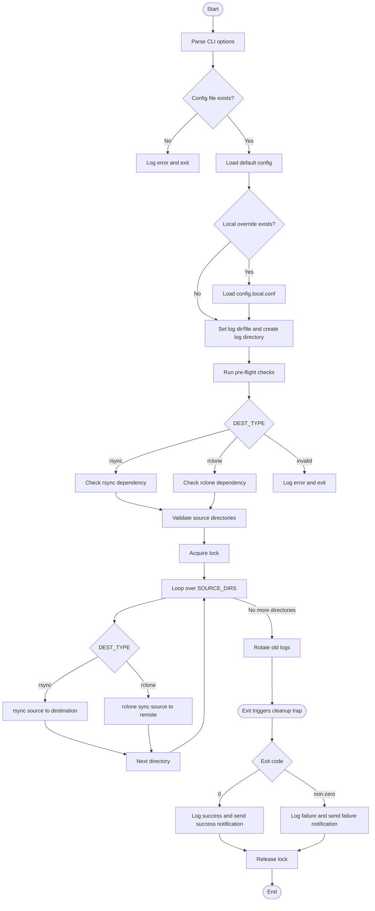

# File Backup & Sync Flowchart

```mermaid
flowchart TD
    A([Start]) --> B[Parse CLI options]
    B --> C{Config file exists?}
    C -- No --> C1[Log error and exit]
    C -- Yes --> D[Load default config]
    D --> E{Local override exists?}
    E -- Yes --> F[Load config.local.conf]
    E -- No --> G[Set log dir/file and create log directory]
    F --> G
    G --> H[Run pre-flight checks]
    H --> I{DEST_TYPE}
    I -- rsync --> J[Check rsync dependency]
    I -- rclone --> K[Check rclone dependency]
    I -- invalid --> I1[Log error and exit]
    J --> L[Validate source directories]
    K --> L[Validate source directories]
    L --> M[Acquire lock]
    M --> N[Loop over SOURCE_DIRS]
    N --> O{DEST_TYPE}
    O -- rsync --> P[rsync source to destination]
    O -- rclone --> Q[rclone sync source to remote]
    P --> R[Next directory]
    Q --> R
    R --> N
    N -->|No more directories| S[Rotate old logs]
    S --> T([Exit triggers cleanup trap])
    T --> U{Exit code}
    U -- 0 --> V[Log success and send success notification]
    U -- non-zero --> W[Log failure and send failure notification]
    V --> X[Release lock]
    W --> X[Release lock]
    X --> Y([End])
```
